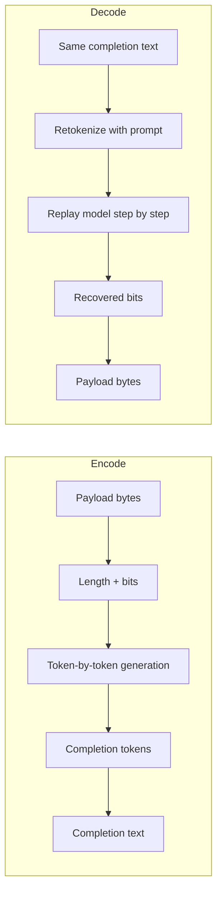

# How llm-steganography works

This document explains the steganographic channel used by this project: what is hidden, how it is embedded, and what sender and receiver must keep identical.

This is not cryptography. It is a covert channel inside a specific generation process. Anyone who can reproduce the same model, prompt, and generation path can recover the hidden data.

## 1. Core idea

A language model does not always have one obvious next token. At each step, it produces a probability distribution over the vocabulary.

Normally, generation just picks the highest-probability token or samples from the distribution. In this project, some steps are used to encode a bit by choosing between two close candidates instead of always taking the top one.

The hidden message is therefore carried by token choice, not by special markup in the text.

## 2. What is hidden

The payload is UTF-8 bytes.

Before embedding, the data is framed as:

- a 32-bit big-endian length header
- followed by the payload bytes
- each byte written MSB-first as bits

So a payload of `L` bytes becomes `32 + 8L` bits.

## 3. How one step works

At each generation step, the model returns next-token probabilities.

The implementation then:

1. Removes end-of-generation tokens
2. Sorts the remaining candidates by:

   - probability descending
   - token id ascending as a deterministic tie-break

3. Looks at the top two candidates

If the top token is much more likely than the second one, the step is treated as a normal generation step and no bit is embedded. If the top two tokens are close enough, the step can carry one bit:

- bit `0` selects the first token
- bit `1` selects the second token

A dominance threshold controls whether a step is considered too peaked to safely encode anything.

## 4. Encoding

To hide a message:

1. Build the same prompt the receiver will use
2. Tokenize it the same way
3. Evaluate the model step by step
4. For each step:

   - if the distribution is dominant, take the top token and do not consume a bit
   - otherwise, choose between the top two tokens based on the next payload bit

5. Stop once all bits have been embedded
6. Detokenize the final token sequence into the visible completion

The output looks like normal text. The hidden data lives in the sequence of token choices that produced it.

## 5. Decoding

Decoding does not read bits directly from the text.

Instead, it replays the same generation process:

1. Rebuild the same prompt
2. Re-tokenize the same completion text
3. Recompute the next-token distribution at each step
4. Check which token was chosen:

   - if the step was dominant, the token must match the top choice
   - otherwise, the token reveals `0` or `1` depending on whether it was the first or second candidate

5. Reassemble the bit stream
6. Remove the length header and decode the UTF-8 payload

If the text, prompt, tokenizer, or model differs, decoding can fail.

## 6. Why the completion must match exactly

This system works on tokens, not on characters.

A tiny edit to the visible string can change token boundaries and break replay. That is why the sender and receiver must use the exact same completion text.

## 7. Limits

- This is not secret against someone who can reproduce the same model and prompt
- Editing the completion usually breaks recovery
- Capacity depends on how often the model produces non-dominant steps
- Strongly peaked distributions reduce embedding capacity

## 8. Mental model

## 9. Code references

- `src/payload-bytes.ts` handles framing and bit conversion
- `src/stego.ts` handles dominant steps, token selection, and encode/decode
- `src/stego-log.ts` contains optional debug logging

`DOMINANCE_FACTOR` controls the tradeoff between stealth and capacity. A higher value hides fewer bits but keeps generation closer to standard model behavior.
