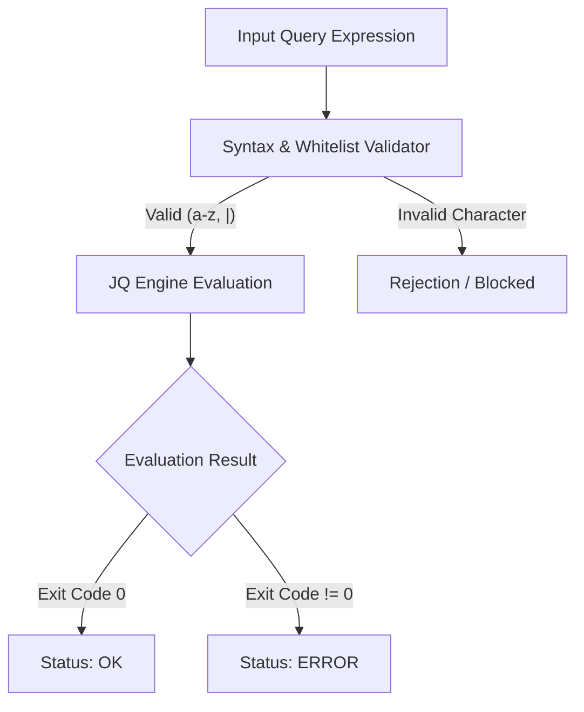

# Technical Architecture & Progress Status Guide

This document presents the system design, empirical findings, constraint evaluation concepts, and the current state of local/remote extraction progress.

---

## 1. System Overview & Architecture

The evaluation model consists of three core components:



- **Filter Pipeline**: Validates incoming query expressions against strict character set constraints (`a-z` and `|`) before execution.
- **Evaluation Engine**: Executes queries in an isolated `jq` process context.
- **Oracle Response**: Maps process execution return codes to qualitative status signals (`OK` vs `ERROR`).

---

## 2. Whitelist Validation Rules

Expressions must adhere strictly to the allowed character whitelist in `server.py`:

| Property | Rule |
| :--- | :--- |
| **Allowed Characters** | Lowercase letters (`a` - `z`) and pipe symbol (`\|`) |
| **Disallowed Characters** | Numbers (`0`-`9`), brackets (`[]`), quotes (`"`), spaces, dots (`.`), etc. |
| **Evaluation Mode** | Non-interactive process invocation (`jq -n <expr>`) |

---

## 3. Current Progress & Verified Findings

### A. Confirmed Milestones

1. **Target Identification**:
   - The expression `env|flatten|sort|last` reliably extracts the flag environment variable because its value (`jail{...}`) begins with `j` (ASCII 106), lexicographically larger than standard system environment keys.
2. **Length Verification**:
   - The flag length is empirically verified to be exactly **122 characters**.
3. **Prefix & Suffix Verification**:
   - Verified prefix: `jail{` (positions 0 to 4).
   - Verified suffix: `}` (position 121).

### B. Extracted Partial Character Structure

Using forward and reverse stream index evaluation (`tostream|flatten|add`), several character segments have been recovered across positions:

```text
jail{?????????????????????????_?????????9??????????7f?????c??????8c??????????6c?????????2????????????7?????????????x?????}
```

---

## 4. Technical Bottlenecks & Analysis

### 1. Lookup Table Coverage Gaps (`CHAINS`)
- The precomputed lookup table `CHAINS` contains **225 entries**.
- For certain positions and candidate characters, both the forward sum $V_{\text{fwd}} = \text{pos} + \text{ord}(c)$ and reverse sum $V_{\text{rev}} = (121 - \text{pos}) + \text{ord}(c)$ result in integer values not present in `CHAINS`.
- **Impact**: Positions where $V \notin \text{CHAINS}$ yield missing matches unless multi-feature mappings (`min`, `max`, `uniqadd`) or expanded chain entries are utilized.

### 2. Network & Socket Limits
- **Connection Cap**: The server configuration enforces `JAIL_CONNS_PER_IP = 2`. Opening more than 2 simultaneous TCP sockets triggers immediate connection termination or refusal.
- **Socket Disconnections (`BrokenPipeError`)**: Transmitting very large batches (>32 queries per payload) or holding sockets open beyond the server timeout window causes premature socket closure.

---

## 5. Summary of Equations & Logic

### Index & Character Mapping Equations

1. **Forward Stream Indexing**:
   $$V_{\text{fwd}} = \text{index} + \text{ord}(c)$$
   Evaluated via stream decomposition: `tostream | flatten | add`

2. **Reverse Stream Indexing**:
   $$V_{\text{rev}} = (121 - \text{index}) + \text{ord}(c)$$
   Evaluated via stream reversal: `reverse | implode | explode | tostream | flatten | add`

3. **Dual-Direction Intersection**:
   A character candidate $c$ at position $\text{index}$ is confirmed if and only if both $V_{\text{fwd}}$ and $V_{\text{rev}}$ trigger the expected error predicate.
