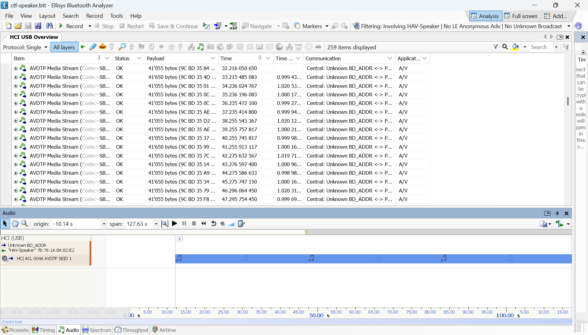
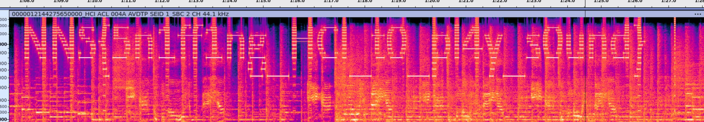

# CTF speaker

The handout for this task is a capture file from the Ellisys Explorer Bluetooth analyser.
The capture contains USB HCI (host-controller-interface) capture from a PC playing back sound to a Bluetooth speaker.

Using the Ellisys software, the audio can be played or exported.

The sound consists of some EPT music that is interrupted by the I-ku-toppene theme. There is some strange sounds in the middle of the sound.
If the file is opened in Audacity and a spectrogram is shown, the flag can be read.

Flag: `NNS{5n1ff1ng_HCI_t0_pl4y_s0und}`